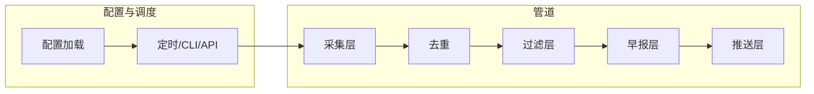
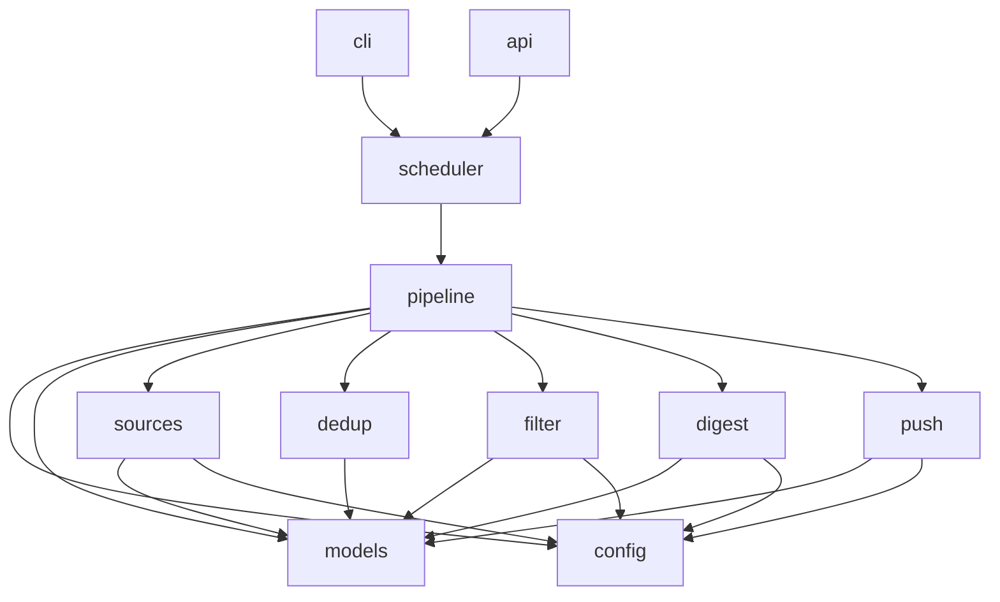

# 私人消息流推送助手 - 技术设计文档

| 项目 | 内容 |
|------|------|
| 文档标题 | 私人消息流推送助手 - 技术设计文档 |
| 版本 | v1.0 |
| 日期 | 2025-02-15 |
| 对应 PRD | 《私人消息流推送助手 - 产品需求说明》v1.1 |
| 技术栈 | Python 3.10+，纯后端，无前端 |

---

## 1. 项目总架构

### 1.1 系统分层与边界

本系统为**单机部署的纯后端应用**，采用管道式处理：采集 → 去重 → 过滤 → 早报生成 → 推送。各层通过统一数据模型（RawItem、Digest）衔接，无前端、无多租户。



- **配置与调度**：加载 YAML/JSON 配置（含环境变量替换），通过 cron 或内置调度器（如 APScheduler）定时触发管道，或通过 CLI/可选 HTTP API 手动触发。
- **采集层**：按配置的 sources 拉取数据，输出统一 RawItem 列表；单源失败不影响其他源。
- **去重**：对 RawItem 按 link 或 raw_id 归一化去重（PRD F6）。
- **过滤层**：按 filter.strategy 执行规则过滤和/或 Agent 过滤，输出过滤并排序后的 RawItem 列表。
- **早报层**：按 digest.strategy 执行模板生成和/或 Agent 生成，输出 Digest（含 rendered）。
- **推送层**：按 push.channels 将 Digest 渲染为各渠道所需格式并发送；单渠道失败不影响其他渠道。

### 1.2 部署拓扑

- **运行环境**：单台服务器（物理机/云主机/容器均可）。
- **进程模型**：单进程；定时任务在同一进程内执行管道，或由系统 cron 调用 CLI 一次执行。
- **网络**：出向访问信息源（RSS/API/爬虫目标）、LLM API、推送渠道（SMTP、Bark、Telegram 等）；无入向公网端口要求（若提供 HTTP API 则仅需本地或内网监听）。
- **存储**：默认无持久化；可选 SQLite/文件用于去重、增量（F6）或运行记录。

---

## 2. 技术选型

| 类别 | 选型 | 版本约束 | 理由 |
|------|------|----------|------|
| 语言与运行时 | Python | 3.10+ | PRD 明确；3.10+ 便于使用 match/类型注解与标准库改进。 |
| 包与依赖管理 | pip + pyproject.toml（或 requirements.txt） | - | 标准方式，便于锁定依赖版本与虚拟环境。 |
| 配置解析 | PyYAML + Pydantic | - | YAML 与 PRD 一致；Pydantic 做 schema 校验与环境变量注入。 |
| HTTP 客户端 | httpx | - | 支持 async/sync、超时、重试；用于 API 拉取、Bark/Telegram/Webhook、LLM 调用。 |
| RSS/Atom 解析 | feedparser | - | PRD 与行业通用选型。 |
| 爬虫/HTML 解析 | requests + BeautifulSoup4（或 parsel） | - | 轻量、易维护；复杂站可后续引入 Scrapy。 |
| LLM 调用 | openai 官方库或 openai-compatible 封装 | - | 与 PRD「OpenAI API 兼容的 chat 接口」一致；可统一封装 endpoint + api_key。 |
| 模板渲染（早报） | Jinja2 | - | 标题/正文模板、占位符替换。 |
| 定时调度 | APScheduler 或 系统 cron | - | 内置调度便于单进程部署；cron 更简单、无依赖。 |
| CLI | Click 或 argparse | - | 子命令：run、validate-config、dry-run 等。 |
| 可选 HTTP API | FastAPI | - | PRD 可选；便于本地/内网触发与健康检查。 |
| 日志 | logging 标准库 | - | 按阶段打日志，级别可配置；不记录敏感信息。 |

**不选型**：前端框架、数据库（默认无）、消息队列（单机管道即可）。

---

## 3. 模块拆分

### 3.1 包/模块与 PRD 功能映射

| 模块（Python 包/命名空间） | 职责 | 对外暴露 | 对应 PRD |
|----------------------------|------|----------|----------|
| **config** | 配置加载、环境变量替换、schema 校验 | 加载后的配置对象（Sources/Filter/Digest/Push） | F5 |
| **models** | RawItem、Digest、Section 等数据实体 | 供全管道使用的 dataclass 或 Pydantic 模型 | 6.1 |
| **sources** | 多源拉取 | 统一返回 List[RawItem]；内部按 type 分发到 rss/api/crawler | F1 |
| **dedup** | 去重 | 输入/输出 List[RawItem]，按 link 或 raw_id 去重 | F6 |
| **filter** | 过滤与排序 | 输入 List[RawItem] + filter 配置，输出 List[RawItem]；内含 rule 与 agent 子模块 | F2 |
| **digest** | 早报生成 | 输入 List[RawItem] + digest 配置，输出 Digest；内含 template 与 agent 子模块 | F3 |
| **push** | 多通道推送 | 输入 Digest + push 配置，按渠道发送 | F4 |
| **pipeline** | 管道编排 | 串联 sources → dedup → filter → digest → push，处理异常与日志 | F1–F5 |
| **scheduler** | 调度入口 | 定时触发 pipeline.run() 或由 CLI/API 调用 | F5 |
| **cli** | 命令行入口 | 子命令：run、validate-config 等 | F5 |
| **api**（可选） | HTTP 接口 | POST /v1/digest/run 等 | F5 |

### 3.2 模块依赖关系



- **config**、**models** 为底层，无业务管道依赖。
- **pipeline** 只依赖各单点能力（sources/dedup/filter/digest/push），不关心具体策略实现细节；策略由 config 驱动。

### 3.3 推荐项目目录结构（Python 包布局）

```
project_root/
├── pyproject.toml          # 或 setup.py + requirements.txt
├── config.yaml.example      # 示例配置（含占位符，无真实密钥）
├── src/
│   └── app/                 # 主包名，可替换为 digest_assistant 等
│       ├── __init__.py
│       ├── config.py        # 配置加载、环境变量替换、Pydantic 模型
│       ├── models.py        # RawItem, Digest, Section, RenderedDigest
│       ├── pipeline.py      # 管道编排
│       ├── sources/
│       │   ├── __init__.py   # fetch_all, 工厂
│       │   ├── base.py       # BaseFetcher 抽象
│       │   ├── rss.py
│       │   ├── api.py
│       │   └── crawler.py
│       ├── dedup.py
│       ├── filter/
│       │   ├── __init__.py   # filter_and_sort
│       │   ├── rule.py
│       │   └── agent.py
│       ├── digest/
│       │   ├── __init__.py   # generate_digest
│       │   ├── template.py
│       │   └── agent.py
│       ├── push/
│       │   ├── __init__.py   # send_all
│       │   ├── base.py
│       │   ├── email.py
│       │   ├── bark.py
│       │   └── telegram.py
│       ├── scheduler.py     # 定时触发或一次 run
│       ├── cli.py            # Click/argparse 入口
│       └── api.py            # 可选 FastAPI
├── tests/
│   ├── test_sources.py
│   ├── test_filter.py
│   ├── test_digest.py
│   ├── test_push.py
│   └── test_pipeline.py
└── docs/
    ├── PRD-私人消息流推送助手.md
    └── TECH-私人消息流推送助手.md
```

入口示例：`python -m app cli run` 或 `python -m app.cli run`（依包结构而定）。

### 3.4 工作量拆分建议（供开发排期）

| 序号 | 模块/任务 | 建议优先级 | 说明 |
|------|-----------|------------|------|
| 1 | models + config | P0 | 先定数据模型与配置 schema，其他模块依赖此接口。 |
| 2 | sources（rss + api + crawler 至少各一） | P0 | 实现 BaseFetcher 与具体 Fetcher，输出 RawItem 列表。 |
| 3 | dedup | P0 | 按 link/raw_id 去重，接口简单。 |
| 4 | filter（rule） | P0 | 关键词、来源、时间、排序；无 Agent 时可独立验收。 |
| 5 | filter（agent） | P0 | LLM 调用封装、prompt 构造、返回解析与 fallback。 |
| 6 | digest（template） | P0 | Jinja2 模板、分组逻辑、rendered 输出。 |
| 7 | digest（agent） | P0 | LLM 调用、结构化/rendered 输出解析与 fallback。 |
| 8 | push（email + 至少一种其他） | P0 | 邮件 SMTP + Bark 或 Telegram 等，各渠道独立实现。 |
| 9 | pipeline | P0 | 串联各步、异常隔离、日志。 |
| 10 | scheduler + cli | P0 | 定时触发 + run/validate-config。 |
| 11 | 可选 API、F6 增量存储 | P1 | 按需实现。 |

### 3.5 各模块实现要点（供开发实现时参考）

- **sources**：为每种 type 实现一个 Fetcher；RSS 用 feedparser.parse(url)，API 用 httpx.get/post + JSON 解析并映射为 RawItem，Crawler 用 requests + BeautifulSoup 按配置 selector 取标题/链接/时间，统一返回 `List[RawItem]`；id 建议 `hashlib.sha256(f"{source_id}:{raw_id}".encode()).hexdigest()[:16]` 或简单拼接。
- **filter/rule**：先按 allowed_sources/blocked_sources 过滤，再按 include_keywords/exclude_keywords 在 title+summary 中匹配，再按 max_age_hours 过滤时间，最后按 sort_by/order 排序。
- **filter/agent**：将 RawItem 列表序列化为 JSON（可截断 summary 长度），与 user_preference 拼成 prompt；调用 OpenAI 兼容 API，解析返回中的 keep_ids 或 scored；若超时或 JSON 解析失败则执行 PRD 约定的 fallback。
- **digest/template**：用 Jinja2 渲染 title_template（传入 date），按 group_by 将条目分组为 sections，再渲染 body 模板得到 markdown/html；无条目时渲染占位模板。
- **digest/agent**：将条目列表 + constraints 拼成 prompt；若 output_format 为 structured 则要求模型返回 JSON 并反序列化为 Digest；若为 rendered 则取返回文本填入 Digest.rendered；失败则调用 template 模块生成。
- **push**：各渠道一个函数或类；email 用 smtplib.SMTP，Bark 用 httpx.get 构造 URL，Telegram 用 httpx.post 到 sendMessage；Digest 的 rendered 中取对应格式（如 html 给邮件、markdown 给 Telegram）；Bark 单条长度有限可截断或只发标题+链接。

---

## 4. 架构设计

### 4.1 核心流程（一次早报任务）

1. **加载配置**：读取 YAML/JSON，替换 `${VAR}` 为环境变量，Pydantic 校验。
2. **采集**：遍历 `sources`，按 type 调用对应 Fetcher；合并为 List[RawItem]，单源异常仅记日志。
3. **去重**：按 `link`（或 raw_id）归一化，保留首次出现的条目。
4. **过滤**：  
   - 若 strategy 为 `rule` 或 `rule_then_agent`：执行规则过滤与排序。  
   - 若 strategy 含 `agent`：将当前列表 + user_preference 调用 LLM，解析 keep_ids/scored，保留对应条目并排序；失败则按 PRD fallback。
5. **早报生成**：  
   - 若 strategy 为 `template` 或 `template_then_agent`：用模板生成 Digest。  
   - 若 strategy 含 `agent`：将条目 + constraints 调用 LLM，解析 JSON 或 rendered 文本；失败则回退模板。
6. **推送**：遍历 enabled channels，按渠道渲染（如 HTML for 邮件、Markdown for Telegram），发送；单渠道失败记日志并继续。

### 4.2 扩展点

- **新增信息源类型**：在 `sources` 包下新增 Fetcher 类，实现统一接口（如 `fetch(config: SourceConfig) -> List[RawItem]`），并在工厂中根据 `type` 注册。
- **新增推送渠道**：在 `push` 包下新增 Sender 类，实现 `send(digest: Digest, channel_config) -> Result`，并在工厂中根据 `type` 注册。
- **过滤/生成策略**：通过 config 的 strategy 选择 rule/agent/组合，无需改管道代码；Agent 的 prompt_template 可配置，便于调优。

### 4.3 容错与降级

- **采集**：单源超时/错误 → 记录日志，跳过该源，继续其他源。
- **过滤 Agent**：超时或返回非 JSON → 按 PRD：rule_then_agent 用规则结果，agent 用全部保留或可配置默认。
- **早报 Agent**：超时或解析失败 → 按 PRD：回退到模板生成。
- **推送**：单渠道失败 → 记录日志，继续下一渠道；不重试或可配置重试次数。

---

## 5. 接口设计

### 5.1 模块间接口（Python 调用约定）

- **config**  
  - `load_config(path: str | None, env: Mapping[str, str] | None) -> AppConfig`  
  - 返回包含 `sources`、`filter`、`digest`、`push` 等的不可变或冻结配置对象；校验失败抛出自定义异常并带清晰信息。

- **sources**  
  - `fetch_all(sources: List[SourceConfig], timeout_per_source: int) -> List[RawItem]`  
  - 内部按 source.type 分发到 rss/api/crawler fetcher；合并结果，单源异常不抛出不中断。

- **dedup**  
  - `deduplicate(items: List[RawItem], key: Literal["link", "raw_id"] = "link") -> List[RawItem]`  
  - 保持首次出现顺序。

- **filter**  
  - `filter_and_sort(items: List[RawItem], filter_config: FilterConfig) -> List[RawItem]`  
  - 内部根据 strategy 调用 rule 和/或 agent；agent 超时/解析失败按 PRD fallback。

- **digest**  
  - `generate_digest(items: List[RawItem], digest_config: DigestConfig) -> Digest`  
  - 内部根据 strategy 调用 template 和/或 agent；无条目时返回占位 Digest；agent 失败回退模板。

- **push**  
  - `send_all(digest: Digest, push_config: PushConfig) -> List[ChannelResult]`  
  - 每个 channel 返回 ChannelResult(success: bool, channel_type: str, error: str | None)。

- **pipeline**  
  - `run(config: AppConfig) -> PipelineResult`  
  - PipelineResult 包含：steps_done、digest（可选）、channel_results、errors（可汇总日志）。

### 5.2 可选 HTTP API（若实现）

| 方法 | 路径 | 说明 |
|------|------|------|
| POST | /v1/digest/run | 触发一次完整管道，返回 202 或 200 + 简要结果（如条数、推送成功数）。 |
| GET | /health | 健康检查（如配置加载成功即 200）。 |

认证：PRD 未强制；若需鉴权，建议 API Key Header 或内网-only。

### 5.3 与外部系统的集成

- **RSS/Atom**：GET 请求 + feedparser 解析；无需鉴权（若源需要可在 config 中加 headers）。
- **开放 API**：GET/POST + httpx；headers/params 来自 config，API Key 用环境变量。
- **LLM**：OpenAI 兼容 Chat Completions API；POST JSON，从 config 读 endpoint、model、api_key（环境变量）；超时与 max_tokens 来自 config。
- **邮件**：smtplib 或 aiosmtplib；TLS、账号密码来自 config（密码环境变量）。
- **Bark**：GET/POST 到 `{base_url}/{key}/{title}/{body}`，URL 编码；key 环境变量。
- **Telegram**：`https://api.telegram.org/bot<token>/sendMessage`，token 与 chat_id 环境变量。
- **企业微信/钉钉**：POST Webhook URL，JSON body（Markdown 或 text）；URL 可环境变量。

---

## 6. 数据模型与存储

### 6.1 核心领域模型（与 PRD 6.1 对齐）

建议使用 **dataclass** 或 **Pydantic BaseModel**，便于序列化与校验。

**RawItem**

```python
# 建议字段
id: str
source_id: str
raw_id: str
title: str
link: str
summary: str | None
published_at: datetime | None  # 或 ISO8601 字符串
extra: dict[str, Any]  # 可选，如 tags, author
```

- `id`：可由 `hash(source_id + raw_id)` 或 `f"{source_id}:{raw_id}"` 生成，保证唯一。

**Digest**

```python
id: str
title: str
generated_at: str  # ISO8601
sections: list[Section]
rendered: RenderedDigest  # { "text": str?, "markdown": str?, "html": str? }

class Section:
    name: str
    items: list[RawItem]  # 或精简版 ItemSummary(title, link, summary)
```

**过滤 Agent 返回（约定）**

- 方案 A：`{"keep_ids": ["id1", "id2", ...]}`
- 方案 B：`{"scored": [{"id": "id1", "score": 0.9}, ...]}`

**早报 Agent 返回（约定）**

- 结构化：与 Digest 同构的 JSON（title, generated_at, sections, 可选 rendered）。
- 直接渲染：纯文本/Markdown/HTML 字符串，由调用方填入 `Digest.rendered`，title 由系统补全。

### 6.2 配置模型（Pydantic 建议）

- **SourceConfig**：id, type (Literal["rss","api","crawler"]), url/endpoint, name?, params?, headers?, 以及 crawler 专用字段（如 selector）。
- **FilterConfig**：strategy, 规则字段（include_keywords, exclude_keywords, allowed_sources, blocked_sources, max_age_hours, sort_by, order）, agent?（endpoint, api_key, model, user_preference, timeout_seconds, max_items_per_call 等）。
- **DigestConfig**：strategy, title_template, max_items, group_by, agent?（endpoint, api_key, model, constraints, output_format, timeout_seconds, max_input_items 等）。
- **PushConfig**：channels: list[ChannelConfig]；ChannelConfig：type, enabled, 以及各渠道专属字段（smtp_*, bark key, telegram token/chat_id, webhook url 等）。

环境变量替换：在加载后、校验前，对字符串值做 `${VAR}` 或 `$VAR` 替换（可从 os.environ 或传入的 env dict 读取）。

### 6.3 存储

- **默认**：无持久化；每次 run 从零拉取、去重、过滤、生成、推送。
- **可选（F6 增量）**：SQLite 或 JSON 文件记录已处理 raw_id/link 或 last_run 时间，下次只处理新条目；实现方可在 dedup 或 sources 后增加「只保留未见过」的逻辑。

---

## 7. 安全与合规

- **凭证**：API Key、SMTP 密码、Telegram token、Bark key 等仅通过环境变量注入，不在配置文件中明文存储；配置文件中使用占位符如 `"${FILTER_AGENT_API_KEY}"`。
- **日志**：不打印请求/响应 body、不记录密码或 token；可记录 channel_type、source_id、条数、是否成功等。
- **爬虫**：遵守目标站 robots.txt；请求间隔、User-Agent 可配置；不实现验证码识别等强反爬（PRD 范围排除）。
- **网络**：调用外部 API 时使用 HTTPS；SMTP 建议 TLS。

---

## 8. 部署与运维

- **环境**：Python 3.10+ 虚拟环境；`pip install -e .` 或 `pip install -r requirements.txt`。
- **配置**：默认从 `./config.yaml` 或环境变量 `CONFIG_PATH` 指定路径加载；生产环境通过 CI/部署脚本注入环境变量。
- **定时任务**：  
  - 方式 A：系统 cron，如 `0 7 * * * cd /app && .venv/bin/python -m app cli run`。  
  - 方式 B：进程内 APScheduler，配置 cron 表达式或 interval，单进程常驻。
- **日志**：输出到 stdout；级别通过环境变量（如 `LOG_LEVEL=INFO`）配置；便于容器/系统收集。
- **监控**：可选在 pipeline 结束打 metrics（如条数、耗时、各步成功与否），对接 Prometheus/StatsD 或仅写日志；告警可基于「连续 N 次推送失败」等规则。

---

## 9. 技术风险与依赖

| 风险 | 缓解 |
|------|------|
| LLM 超时或限流 | 配置超时与重试；fallback 到规则/模板；控制单次条数。 |
| 单次早报耗时过长 | 单源超时上限、Agent 条数上限；可考虑异步或分批调用（实现时评估）。 |
| 第三方 API/源不可用 | 单源/单渠道失败不中断整体；日志与可选告警。 |
| 配置错误导致空早报或误过滤 | 提供 validate-config 子命令；启动时校验 strategy 与 agent 必填项。 |

**外部依赖**：feedparser、httpx、PyYAML、Pydantic、Jinja2、openai（或兼容库）；爬虫可选 BeautifulSoup4/parsel。所有依赖在 pyproject.toml 或 requirements.txt 中固定版本，便于复现与安全更新。

---

## 10. 开发阶段与里程碑

| 阶段 | 交付范围 | 验收对应 |
|------|----------|----------|
| **MVP** | config + models + sources(rss+api) + dedup + filter(rule) + digest(template) + push(email 或 Bark) + pipeline + cli run + 定时触发 | AC1, AC2, AC3, AC4, AC5, AC6, AC7 |
| **Phase 2** | filter(agent) + digest(agent) + 至少 2 种推送渠道 | AC2b, AC3b |
| **Phase 3** | crawler 源、可选 API、F6 增量（可选）、更多推送渠道 | 按需 |

与 PRD 验收标准一一对应：AC1–AC7、AC2b、AC3b 在技术实现中通过单元测试与集成测试覆盖。

---

## 附录 A：术语表

| 术语 | 说明 |
|------|------|
| RawItem | 从任意信息源解析得到的统一条目结构，见 PRD 6.1。 |
| Digest | 早报对象，含 title、generated_at、sections、rendered。 |
| Fetcher | 采集层中针对某一类型（rss/api/crawler）的拉取实现。 |
| strategy | 过滤或早报的决策方式：rule/agent/rule_then_agent 或 template/agent/template_then_agent。 |
| fallback | Agent 调用失败时的回退行为（使用规则结果或模板结果）。 |

---

## 附录 B：参考与变更记录

- **参考**：PRD《私人消息流推送助手 - 产品需求说明》v1.1；feedparser、OpenAI API、Bark、Telegram Bot API、SMTP 等官方文档。
- **变更记录**：v1.0 初稿，基于 PRD v1.1 完成 Python 技术方案、模块拆分、接口与数据模型、部署与里程碑。

---

**文档结束。开发可根据本文档进行分模块实现与联调；遇与 PRD 不一致处以 PRD 为准，技术实现细节可在本技术文档内迭代更新。**
